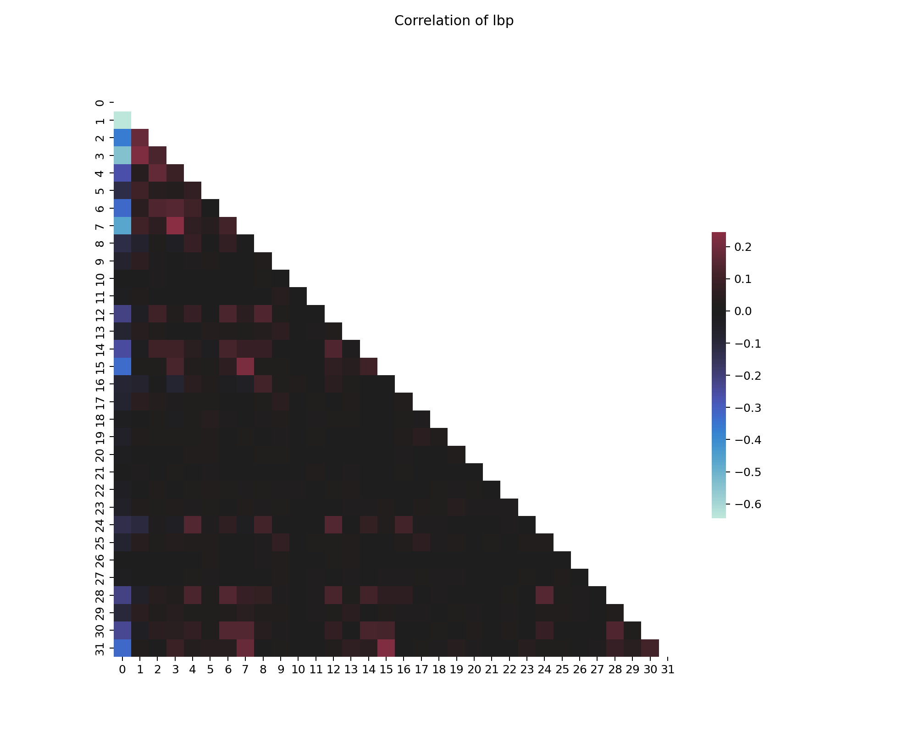
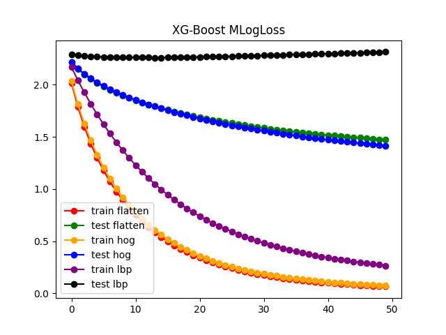

MLRF REPORT

Project members :
- nicolas.bozanski
- louis.gras

The goal of this project was to recognize image by feeding traditional classifiers models with images features. We had to make a clean pipeline from treating dataset to model testing and analyze results. Dataset used will be CIFAR-10 one.

In details, specifications were :
- Introduce the state of the art about images recognition.
- Analyzing dataset
- 3 features extraction (including flatten image)
- 3 classifiers (linear and parametric and 2 non-parametric)
- Analyzing results
- Going further

### Introduce the state of the art about images recognition

In image recognition, 2 main techniques are used.

- <u>Features extraction + feed traditional ML algorithm :</u> on CIFAR-10 dataset performances go up to ~65% with random forests classifier which is 6 times better than a random choice (10%). However, further more it's "low" accuracy, it also requires on each evaluation to compute feature which could not scale on built-in cards to detect element in real time with important frame rate constraints. This technique has nevertheless some benefits : you can have a better overview on latent space.

- <u>Deep learning :</u> Default neural networks aren't that great to perform image recognition task. However, using convolution bring them to the most used technique to detect images. Indeed, filters automatically detect interesting features which improves a lot tests to make and also to evaluate an image. Last achievement in the domain is using CAMs to interpret the prediction decision made by the convolutional neural network which partly leads in 2023 a new record on CIFAR-10 dataset : 99.7% accuracy.

### Analyzing dataset

Dataset is made up of 32x32 colour images separated into a train set (50'000 images) and a test set (10'000 images). There are 10 types of images :

0. Planes
1. Cars
2. Birds
3. Cats
4. Deers
5. Dogs
6. Frogs
7. Horses
8. Boats
9. Trucks

  
  

    Figure 1:
    Display 81 random planes images in the train set
  

We have to check labels repartition to see if we have to compensate a dizziness by stratifying train set split :

  
  

    Figure 2:
    Labels repartition train set
  

  
  

    Figure 3:
    Labels repartition test set
  

It sounds the author of this dataset intentionally made a perfect balanced dataset.
So the dataset is be ready to use.

### 3 features extraction

_At the end of the feature computation, I've normalized the data using a standard scaler._

#### Flatten

Flatten is a naive approach to directly put image to a vector.

  
  

    Figure 4:
    Flatten image schema
  

|Pros ✅|Cons ❌|
|-|-|
|Contains a lot of information|High Dimensionality|
|Easy to compute|huge information loss on the structure|
||No information detection to help model|

#### HOG

HOG or Histogram of oriented gradients, counts occurrences of gradient orientation in localized portions of an image. This method is similar to that of edge orientation histograms, scale-invariant feature transform descriptors, and shape contexts, but differs in that it is computed on a dense grid of uniformly spaced cells and uses overlapping local contrast normalization for improved accuracy.

  
  

    Figure 5:
    HOG gradient vision and histogram making
  

|Pros ✅|Cons ❌|
|-|-|
|Robustness to Local Geometric and Photometric Changes|High Dimensionality|
|Capture of Shape Information|Lack of Scale Invariance|
|Performance with traditional ML|Dependence on Quality of Image|

We might have to check correlation to have a pre-filter to know if the feature is interesting :

  
  

    Figure 6:
    Correlation of HOG
  

Higher and not really present most correlation is around 0.6 and a really low max value of anti-corelation.
It shows that this feature can be interesting due to the amount of information.

#### LBP

LBP or Local Binary Patterns is a very efficient texture operator which labels the pixels of an image by thresholding the neighborhood of each pixel and considers the result as a binary number.

  
  

    Figure 7:
    LBP pixel treatment
  

|Pros ✅|Cons ❌|
|-|-|
|Computational Efficiency|Lack of Robustness to Scale and Rotation Changes|
|Robustness to Monotonic Gray-Scale Changes|Noise Sensitivity|
|Texture Description|Lack of Semantic Understanding|

Same as HOG, we have to check correlation.

  
  

    Figure 8:
    Correlation of LBP
  

There are only few values with an anti-correlation around -0.6 which means that LBP doesn't contains duplicates information.

All features are potentially good to be feed to a traditional ML models. There are also enough differences on features which might gives way differents results to analyze.

### 3 classifiers

**Parametric models** make certain assumptions about the underlying data distribution and have a fixed number of parameters. Once these parameters are learned from the data, the model is fixed and the training data is no longer needed.

|Pros ✅|Cons ❌|
|-|-|
|They require less data|They make strong assumptions about the data|
|They are easier to understand and interpret|They may not fit complex data well, leading to underfitting|

**Non-parametric models** make fewer assumptions about the underlying data distribution and can have an infinite number of parameters. They continue to learn as more data is provided, and they keep the training data for future predictions.

|Pros ✅|Cons ❌|
|-|-|
|They make fewer assumptions about the data|They require more data|
|They can handle complex data and can be more accurate|They can be slower to train and predict|

_For all following time metrics, computations have been done on laptop using a 4 cores 2.5Ghz CPU and a RTX 3060 GPU._
_For training parts, values are for the biggest dataset (flatten one).

#### SVM

For the linear parametric model, we've chose SVM.
Support Vector Machine is initially used to binary classification. However, wrapped with a OneVSRest algorithm make it able to handle multi-label classification.

Idea behind SVM is to adjust a hyperplane to separate 2 classes which can handle regularization and kernels. In this case, we'll use linear kernel.

- Model : LinearSVC from sklearn.svm
- Hyper-params : tol=1e-4, C=1.0, max_iter=50
- Training time : around 10min on single CPU core.

It's hyper-params by default. However, we've fixed max_iter to 50 to avoid some epochs to reach 500/1000 iter and says that model couldn't converge. Ideally, the value have to be increase to 250/350 even so training time would increase.

Because of execution time of each training model, hyper-parameters exploration is too long to get relevant results.

#### KMeans

KMeans isn't a classier it's a clustering algorithm. However, we was curious to see his performances to cluster images and it brings more diversity to compare.

KMeans is a naive algorithm that gather elements according to barycenter of groups.
Basic algorithm randomly starts which leads to huge results divergence. We will use KMeans++ which selects initial cluster centroids using sampling based on an empirical probability distribution of the points’ contribution to the overall inertia.

- Model : KMeans from sklearn.cluster
- Hyper-params : k=10, leaf_size=30
- Training time : around 15 sec on all CPU cores.

Of course we've set k=10 because there are 10 differents labels.

Because of low execution time, we've decided to explore hyper-parameters domain. Grid Search is a bad method it's only for testing values when we know we would have good results.
One of the best algorithm is Differential Evolution when speaking about not staying stuck in a local minimum and it also has a good convergence enough. It is based on Genetic Algorithms but there is an additional forced mutation from combination of other people on all people.

However, there is a big problem. We'll see in in detail but KMeans take a lot of time to evaluate (around a minute)
It's even more important because train set is x5 bigger than test set.
To handle is issue, we've split the dataset on a sub train and set test with a 0.1 ratio. Nonetheless, final model is trained with all the train dataset.

For the objective function score, we've picked minus the accuracy because it's a score to minimize.

- Model : differential_evolution from scipy.optimize
- Bounds : leaf_size=$\llbracket 15~;~150 \rrbracket $
- Hyper-params : popsize=100, maxiter=3
- Execution time : around 25 min on all CPU cores

Because of execution time, we couldn't create a bigger population with more generations.

||Flatten|HOG|LBP|
|-|:-:|:-:|:-:|
|c|0.005|0.005|0.005|
|Best leaf_size|65|39|61|
|Score|-0.3324|-0.5328|-0.15|

Where c is convergence, $c = \frac{(f_{old} - f_{new})}{f_{old}}$
which gives an absolute comparison between old and new best score.
Convergence hasn't same values (round). It shows that algorithm has converged enough because he's less than 1.

We can also see that best leaf_size depends on the feature and score as well.

#### XG-Boost

XGBoost is a gradient boosting framework that uses decision tree algorithms, designed to optimize speed, efficiency, and model performance by minimizing an objective function.

- Model : XGBClassier from xgb
- Hyper-params : max_depth=15, epochs=25, learning_rate=0.1
- Execution time : around 30 min on the GPU (100% usage)

XG-Boost offers the possibility to get the loss (mlogloss) :

  
  

    Figure 8:
    Evolution of MLogLoss during train
  

- **Flatten** : It shows that it could have more train epochs but score error on test set might not change a lot or over-fit.

- **HOG** : The only curve that shows it's relevant to continue further the training because train curve is really clean and would decrease more.

- **LBP** : The outcomes demonstrate that this feature sounds not compatible with the model because of the hardness to learn on the train set. It also indicates that the feature sounds not good because it over-fits almost instantly.

Results on test set might highlights the domination of HOG over the other features.

### Analyzing results

First, let have a look to prediction execution time.

  
  

    Figure 9:
    Predict execution duration
  

There are 3 possibilities :

- We don't need a huge framerate recognition no we can use KMeans
- We will use a feature with low dimension (like LBP) to train model.
- We need performances because we want a huge framerate recognition / we will put this program on a built-in card.

Depending on the scenario KMeans will be or not accepted.

Let's finally examine the accuracy of the models.

  
  

    Figure 10:
    Acc of models
  

These results deepens the dilemma surrounding the choice of the model between KMeans and XG-Boost on HOG feature. Clustering is faster to train but even with a DE optimization to find best hyper-params score is around XG-Boost. So with more calculation power and more time, XG-Boost could grow up to 60% Acc which means that it has 7% more accuracy and it predict around x12 faster.

To complete the analysis, let us now turn our attention to the function matrix.

  
  

    Figure 11:
    Confusion matrix for each models
  

Has we can see, using LBP sounds to be a disaster on us dataset.
KMeans fails the most to predict deers and frogs rather than XG-Boost sounds to have less major fails.

  
  

    Figure 12:
    ROC curves for each models
  

ROC curves shows XG-Boost is way more regular than KMeans but slightly less performant overall.

### Going further

First, us experiment shows that XG-Boost on HOG features might be the best solution we've found to predict correctly the label for an given image.

It also shows that XG-Boost might be a more polyvalent model which implies to try others features on this model and avoid running them on SVM and KMeans to grain time.

#### Understanding best type of features

The plan would be to try others features on XG-Boost :

- Shapes information : SIFT (Scale-Invariant Feature Transform), SURF (Speeded Up Robust Features) or ORB (Oriented FAST and Rotated BRIEF)

Only texture features might give that same bad results as LBP.
However, we can use SIFT on different color layers. For exemple, a really god solution if we have enough computation power would be to get a 3, 4 main colors histogram + grey scale and use SIFT with low dimension hyper-parameters.

That's what we've tried to do (we've quickly did in the 2.0 jupyter).
We've check 3 main colors histogram + grey scale to compute the layers to SIFT.
Then we've done a BOW because SIFT doesn't notice each time same amount of noticeable patterns.
Then we've tried to explore hyper-params of XG-Boost model (n_estimators, max_depth) using bayesian optimization. We made sure training was good (which sounds good):

  
  

    Figure 13:
    Loss over iterations
  

However, results are bad with an accuracy of 35.5%.

  
  

    Figure 14:
    Confusion Matrix
  

It means that color is definitely not a good landmark and we only might have to focus on shape algorithm without considering at all colors.

### Conclusion

To conclude, us best pipeline to classify CIFAR-10 dataset is HOG + XG-Boost with a performance of 53%. However to go improve performances, the best choice sounds to explore more pure geometrical features on XG-Boost.

But this old way of image recognition is almost obsolete face to CNN which is able to easily beat this old way approach. So the most reasonable solution is to upgrade to CNN with CAMs.
Indeed, 99.7% acc model is 156 times better than a 53% acc model. <small>using 1 / (1 - acc) formula</small>